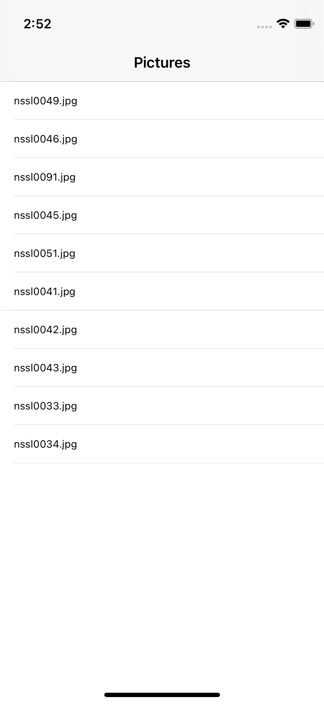

# Day 16: Project 1, part one

## Notes

- Setting up
- Listing images with FileManager
- Designing our interface

On this day, was taught how to create a new project on Xcode.


`FileManager` was introduced on this lecture to navigate to the images that we have included on this project

```swift
let fm = FileManager.default
let path = Bundle.main.resourcePath!
let items = try! fm.contentsOfDirectory(atPath: path)
```

`items` will contain all items we have in our Bundle so we still have to filter out what item we only need

```swift
for item in items {
    if item.hasPrefix("nssl") {
        self.pictures.append(item)
    }
}
```

We append the items/assets with a prefix of `nssl` to our array of strings here.


Next is we subclass our `ViewController` to `UITableViewController` instead of just `UIViewController`. This is in order to gave huge amount of extra functionality for free.

If we didn't subclass our `ViewController` to `UITableViewController`, we have to explicitly subclass our `ViewController` to  `UITableViewDataSource`, insert `TableView` view object in our view, and so on.. Subclassing it to `UITableViewController` will save us it to do this extra things.


```swift
override func tableView(_ tableView: UITableView, numberOfRowsInSection section: Int) -> Int {
    return self.pictures.count
}

override func tableView(_ tableView: UITableView, cellForRowAt indexPath: IndexPath) -> UITableViewCell {
            
    let cell = tableView.dequeueReusableCell(withIdentifier: "Picture", for: indexPath)
    cell.textLabel?.text = self.pictures[indexPath.row]
    return cell
}
```

We inform our _TableView_ of how many cells we should display and what to display on each cell. In this case, we just have a basic cell with a `UILabel` on it which we will update with our item's name


## Screenshots:

