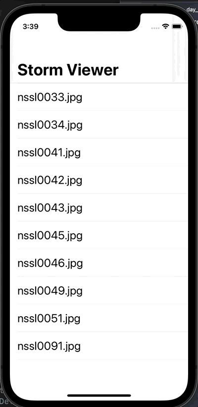

# Day 18: Project 1, part three

## Notes

## Challenges:
- Use Interface Builder to select the text label inside your table view cell and adjust its font size to something larger – experiment and see what looks good.
- In your main table view, show the image names in sorted order, so “nssl0033.jpg” comes before “nssl0034.jpg”.
- Rather than show image names in the detail title bar, show “Picture X of Y”, where Y is the total number of images and X is the selected picture’s position in the array. Make sure you count from 1 rather than 0.

## Screenshots:

