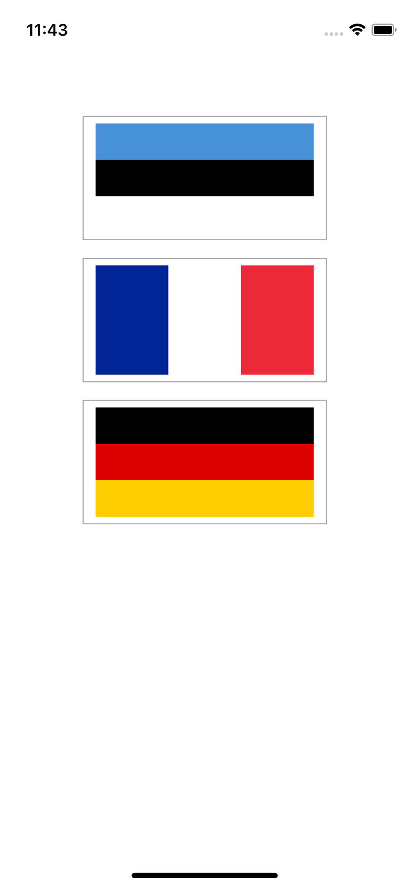

# Day 19: Project 2, part one

## Notes

- Setting up
- Designing layout using UIButtons, Autolayout, Images on Assets
- Making the basic game work: UIButton and CALayer

On this day, we setup a new project for a simple game that we are going to create on the next following days. It's called _Guess The Flag_

On this lecture we learned how to add UIButtons on our app, add some basic autolayouts, adding images on Assets folder and introduction on CALayer in order to add `borderWidth` and `borderColor`

```swift
self.button1.layer.borderWidth = 1
self.button2.layer.borderWidth = 1
self.button3.layer.borderWidth = 1

self.button1.layer.borderColor = UIColor.lightGray.cgColor
self.button2.layer.borderColor = UIColor.lightGray.cgColor
self.button3.layer.borderColor = UIColor.lightGray.cgColor
```


## Screenshots:

