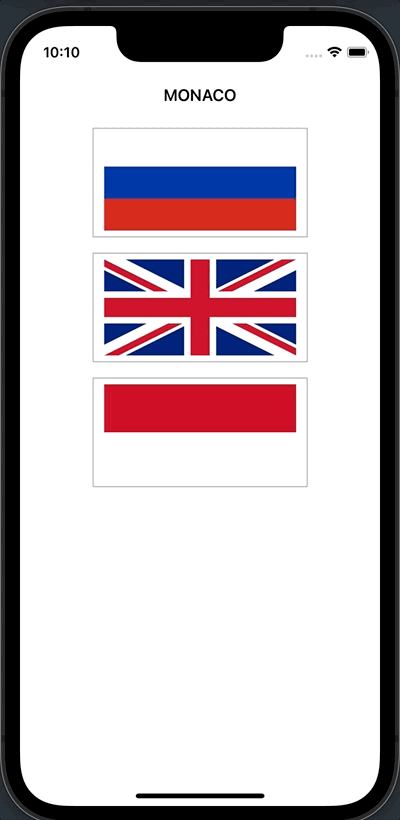

# Day 20: Project 2, part three

## Notes

- Guess which flag: random numbers
- Creating an IBAction from UIButton

On this day we learned how generate random number using the `random(in:)` method of `Int` so that we could randomly select a _Country_ that we would like the user to guess.

We also used the `shuffle()` method from our Countries array in order to display random countries in every round.

Lastly was to make IBActions from UIButton in our Storyboard to handle events on our button tap in country flags.

## Screenshots:

