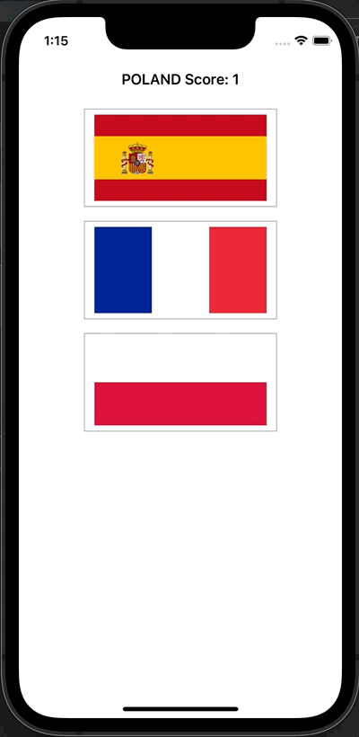
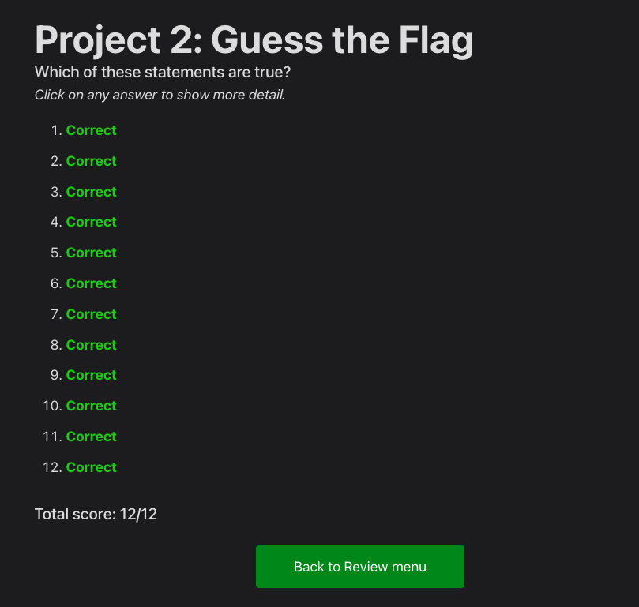

# Day 21: Project 2, part three

## Notes

## Challenges:
- Try showing the player’s score in the navigation bar, alongside the flag to guess.
- Keep track of how many questions have been asked, and show one final alert controller after they have answered 10. This should show their final score.
- When someone chooses the wrong flag, tell them their mistake in your alert message – something like “Wrong! That’s the flag of France,” for example.

On this project, I added a _Play Again_ button to restart the game.

## Screenshots:

