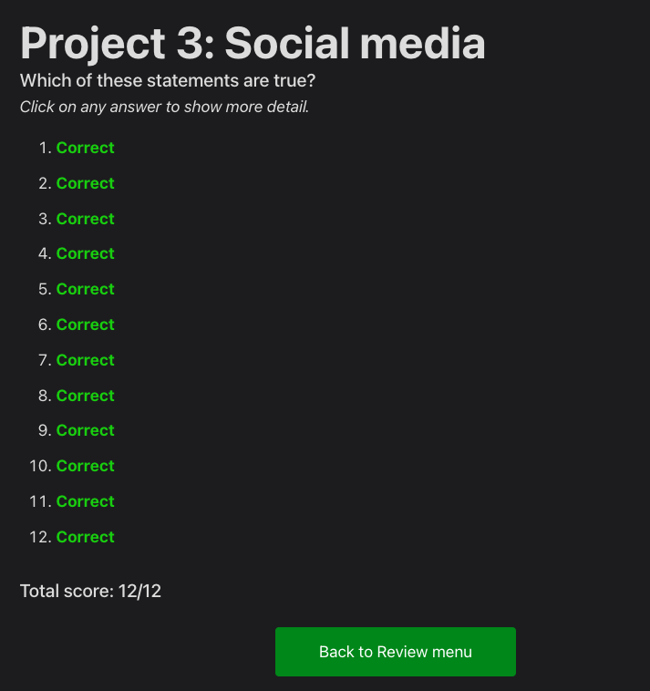

# Day 22: Project 3

## Notes

### UIActivityViewController
- On this lecture, `UIActivityViewController` was introduced. This is usually used to share something within the view of your app.

## Challenges:
- Try adding the image name to the list of items that are shared. The activityItems parameter is an array, so you can add strings and other things freely. Note: Facebook won’t let you share text, but most other share options will.
- Go back to project 1 and add a bar button item to the main view controller that recommends the app to other people.
- Go back to project 2 and add a bar button item that shows their score when tapped. (See Day 21 Folder)

## Screenshots:

