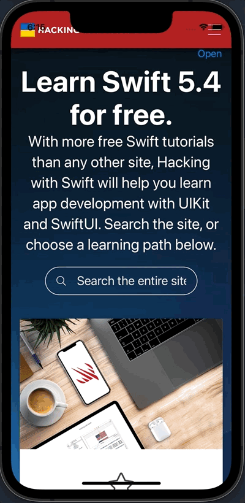

# Day 24: Project 4, Part one

## Notes

- Setting up
- Creating a simple web browser with WKWebView
- UIAlertController(ActionSheet)
- WKWebView Delegate Method

On this day, we start a new project. We created a simple app with a web browser using `WKWebView`. Also `ActionSheet` of `UIAlertController.Style` was introduced for the purpose of switching between two websites. And lastly the _WKWebView Delegate Method_ `didFinish:` to change our the navigation title.

## Screenshots:

