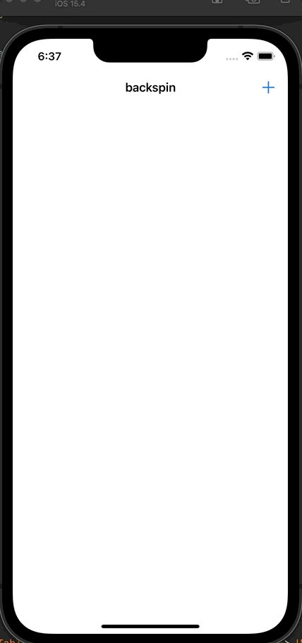

# Day 28: Project 5, Part two

## Notes


On this day, we mainly focused on updating the functions responsible for checking if the word is possible, original and real. Then we add these words to `usedWords` and update the tableView accordingly. Hence if any of these function fails, we will show an _alert view_ of what word checker function failed.

```swift
private func submit(_ answer: String) {
    let lowerAnswer = answer.lowercased()
    
    let errorTitle: String
    let errorMessage: String
    
    if isPossible(word: lowerAnswer) {
        if isOriginal(word: lowerAnswer) {
            if isReal(word: lowerAnswer) {
                usedWords.insert(answer, at: 0)
                
                let indexPath = IndexPath(row: 0, section: 0)
                tableView.insertRows(at: [indexPath], with: .automatic)
                
                return
            } else {
                errorTitle = "Word not recognised"
                errorMessage = "You can't just make them up, you know!"
            }
        } else {
            errorTitle = "Word used already"
            errorMessage = "Be more original!"
        }
    } else {
        guard let title = title?.lowercased() else { return }
        errorTitle = "Word not possible"
        errorMessage = "You can't spell that word from \(title)"
    }
    
    let ac = UIAlertController(title: errorTitle, message: errorMessage, preferredStyle: .alert)
    ac.addAction(UIAlertAction(title: "OK", style: .default))
    present(ac, animated: true)
}
```

We use `UITextChecker` to check if the word is a valid word in english.
```swift
let checker = UITextChecker()
let range = NSRange(location: 0, length: word.utf16.count)
let misspelledRange = checker.rangeOfMisspelledWord(in: word, range: range, startingAt: 0, wrap: false, language: "en")

return misspelledRange.location == NSNotFound
```

## Screenshots:

