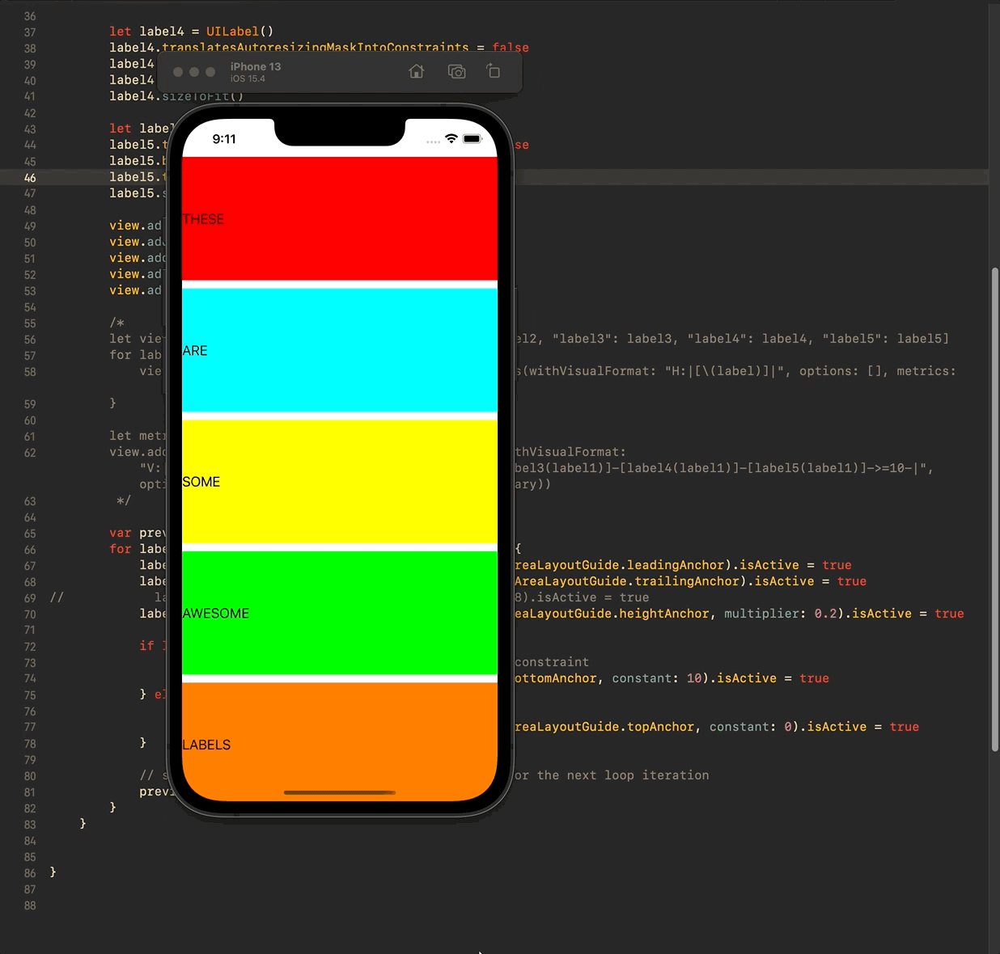

# Day 31: Project 6, Part two

## Notes

On this lecture, we learned how to add additional constraint on VFL and using `metrics` to easily update the constraint value if needed to change.

Also, we learned another way to create autolayout using its `anchors` which is much more easier to read and understand.

### Challenges:
1. Try replacing the widthAnchor of our labels with leadingAnchor and trailingAnchor constraints, which more explicitly pin the label to the edges of its parent.
2. Once you’ve completed the first challenge, try using the safeAreaLayoutGuide for those constraints. You can see if this is working by rotating to landscape, because the labels won’t go under the safe area.
3. Try making the height of your labels equal to 1/5th of the main view, minus 10 for the spacing. This is a hard one, but I’ve included hints below!

## Screenshots:

