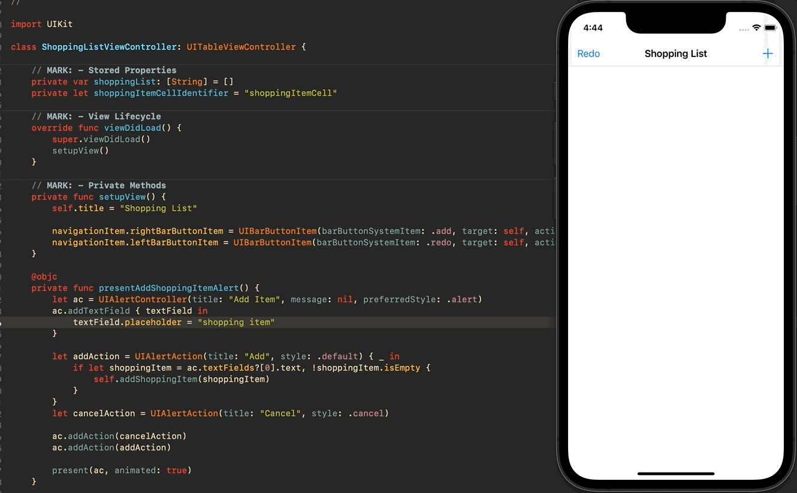

# Day 32: Milestone: Projects 4-6

## Notes

On this day we just reviewed what we have learned from Project 4, 5 and 6. We're going to make an app from scratch as our today's challenge.

### Challenges:
- Create an app that lets people create a shopping list by adding items to a table view.
- add a left bar button item that clears the shopping list
- You might be tempted to try to use UIActivityViewController to share the finished shopping list by email, but if you do that you’ll hit a problem: you have an array of strings, not a single string.

## Screenshots:

