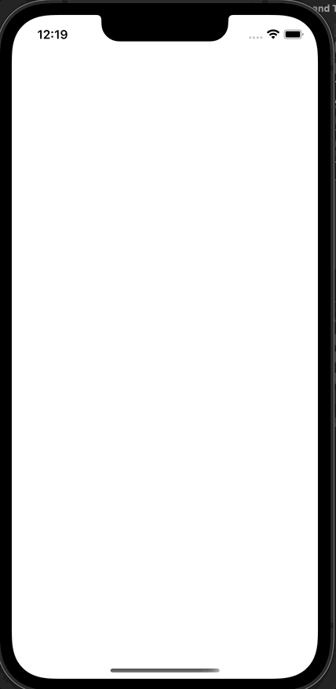

# Day 34: Project 7, Part Two

## Notes

Today we used the `WKWebView` again to display the truncated secondary text on our main view controller, but this time we are loading _HTML string_ directly to the webview using the `loadHTMLString(html:baseURL:)` method.

We also added another tab on our `UITabBarController` to display the _Top Rated Petitions_ and we did that programmatically in our `SceneDelegate` 

```swift
if let tabBarController = window?.rootViewController as? UITabBarController {
    let storyboard = UIStoryboard(name: "Main", bundle: nil)
    let vc = storyboard.instantiateViewController(withIdentifier: "NavController")
    vc.tabBarItem = UITabBarItem(tabBarSystemItem: .topRated, tag: 1)
    tabBarController.viewControllers?.append(vc)
}
```

## Screenshots:

