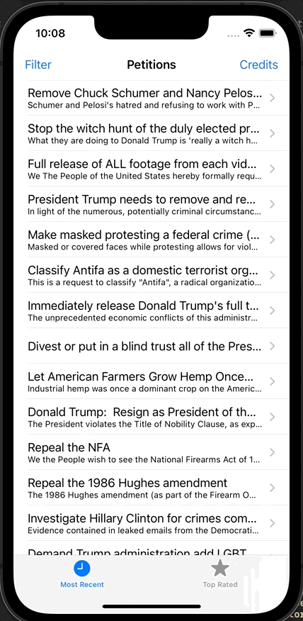

# Day 36: Project 8, Part One

## Notes

- Setting up new project
- Creating views programmatically


So on this day, we start again on a new project wherein we create an app's UI programmatically.

We learned how to activate a constraint using the class function of `NSLayoutConstraint` which is `activate(_:[NSLayoutConstraint])`.

So instead of creating a constraint like this

```swift
scoreLabel.topAnchor.constraint(equalTo: view.layoutMarginsGuide.topAnchor).isActive = true
scoreLabel.trailingAnchor.constraint(equalTo: view.layoutMarginsGuide.trailingAnchor).isActive = true
cluesLabel.topAnchor.constraint(equalTo: scoreLabel.bottomAnchor).isActive = true
cluesLabel.leadingAnchor.constraint(equalTo: view.layoutMarginsGuide.leadingAnchor, constant: 100).isActive = true
```

We notice the repetitive `isActive = true`. We can use the class func mentioned above instead like this:

```swift
NSLayoutConstraint.activate([
    scoreLabel.topAnchor.constraint(equalTo: view.layoutMarginsGuide.topAnchor),
    scoreLabel.trailingAnchor.constraint(equalTo: view.layoutMarginsGuide.trailingAnchor),
    
    cluesLabel.topAnchor.constraint(equalTo: scoreLabel.bottomAnchor),

    cluesLabel.leadingAnchor.constraint(equalTo: view.layoutMarginsGuide.leadingAnchor, constant: 100),
])
```


We also learned an important UIKit properties:

1. **Content hugging priority** determines how likely this view is to be made larger than its intrinsic content size. If this priority is high it means Auto Layout prefers not to stretch it; if it’s low, it will be more likely to be stretched.
2. **Content compression resistance priority** determines how happy we are for this view to be made smaller than its intrinsic content size.

```swift
cluesLabel.setContentHuggingPriority(UILayoutPriority(1), for: .vertical)
answersLabel.setContentHuggingPriority(UILayoutPriority(1), for: .vertical)
```

## Screenshots:

