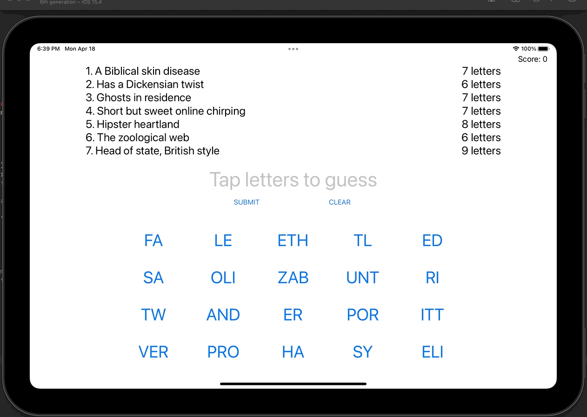

# Day 37: Project 8, Part Two

## Notes

- Loading a level and adding button targets
- It's play time: firstIndex(of:) and joined()
- Property observers: didSet

On this day, we started doing the logic of the game already. First we added two _text files_ which contains the content of our word guessing game.

We load the _text file_ in a way like we did in previous projects using the `Bundle.main.url(forResource:withExtension:)` and gather the text using the `String(contentsOf:)`

We have also used the `firstIndex(of:)` method of an array to check if we can find the word that the user is trying to guess.

We also used the `joined(separator:)` to create a string out from an array of string.

## Screenshots:

