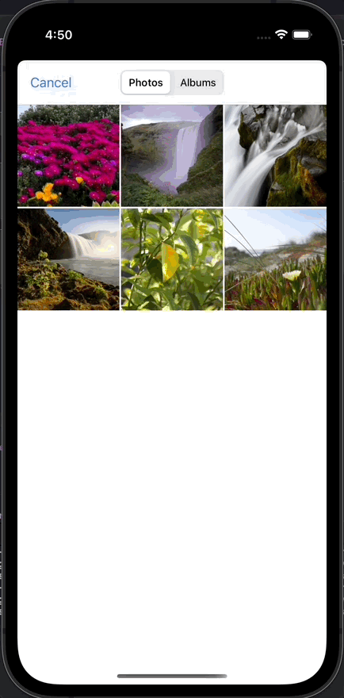

# Day 43: Project 10, Part Two

## Notes

On this day, `UIImagePickerController` was introduced. This class is mainly used when you need to access the user's phone image gallery so that users can select any image they want to use on their app.

```swift
let picker = UIImagePickerController()
picker.allowsEditing = true
picker.delegate = self
present(picker, animated: true)
```

`allowsEditing = true` means that users can crop the image they select


`UIImagePickerController` has a delegate called `imagePickerController(_:didFinishPickingMediaWithInfo:)` which is mainly used to gather all the image info of the selected image from user's image gallery.

```swift
func imagePickerController(_ picker: UIImagePickerController, didFinishPickingMediaWithInfo info: [UIImagePickerController.InfoKey : Any]) {
    guard let image = info[.editedImage] as? UIImage else { return }
    
    let imageName = UUID().uuidString
    let imagePath = getDocumentsDirectory().appendingPathComponent(imageName)
    
    if let jpegData = image.jpegData(compressionQuality: 0.8) {
        try? jpegData.write(to: imagePath)
    }
    dismiss(animated: true)
}
```

## Screenshot:

