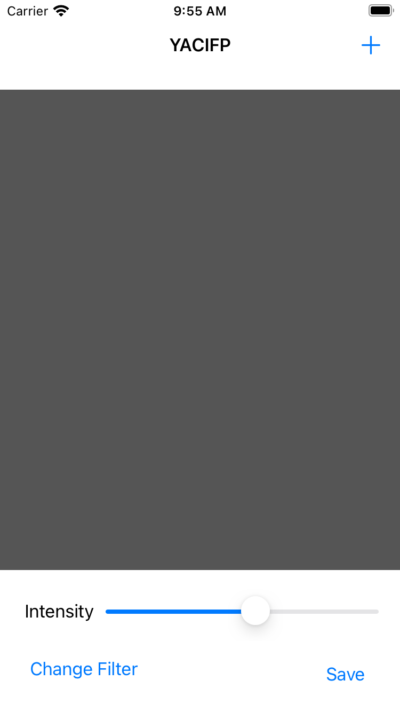

# Day 52: Project 13, Part One

## Notes

Today we start again with a new project where we will learn `CoreImage` and new UIKit Component from these series called `UISlider`.

So first we setup our project and create our UI without adding any contraints yet coz this time we'll use the _Reset to Suggested Constraints_ feature of Auto Layout. Using this, Auto Layout does all the hard work on adding the constraints, but it just take its best guess what our intentions are. So be careful on using this feature as it may add unnecessary constraints.

Finally we add some code to our _View Controller_ and we implement the `UIImagePickerController` again like what we did in our previous projects.

## Screenshots:
