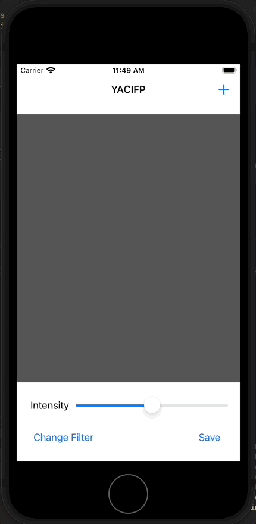

# Day 53: Project 13, Part Two

## Notes
- CIContext
- CIFilter
- Saving to iOS Photo Library

On this day we tackle CIContext, CIFilter and Saving images to iOS Photo Library

## CIContext
CIContext or Core Image Context is a _Core Image_ component that handles the rendering of our photo in this project.

```swift
if let cgimg = context.createCGImage(currentFilter.outputImage!, from: currentFilter.outputImage!.extent) {
    let processedImage = UIImage(cgImage: cgimg)
    self.imageView.image = processedImage
}
```

We use the `createCGIImage(_:from)` method of CIContext to render the image with the filter we use on specific image.

## CIFilter

CIFilter or Core Image Filter simply stores the whatever filter that we choose on the app. We will give it various input settings before we ask it to output a result for us.

```swift
currentFilter = CIFilter(name: "CISepiaTone")

let beginImage = CIImage(image: currentImage)
currentFilter.setValue(beginImage, forKey: kCIInputImageKey)
```

## UIImageWriteToSavedPhotosAlbum

This series introduced a new function that we are going to use on this app to save an image to our _Photo Library_. This function takes in 4 parameters, the most important thing we need to pass here is of course the image that we are going to save and another function the we are going to call to check if there's any error in saving the image.

```swift
@IBAction func save(_ sender: Any) {
    guard let image = imageView.image else { return }
    
    UIImageWriteToSavedPhotosAlbum(image, self, #selector(image(_:didFinishSavingWithError:contextInfo:)), nil)
}

@objc func image(_ image: UIImage, didFinishSavingWithError error: Error?, contextInfo: UnsafeRawPointer) {
        if let error = error {
            // we got back an error!
            let ac = UIAlertController(title: "Save error", message: error.localizedDescription, preferredStyle: .alert)
            ac.addAction(UIAlertAction(title: "OK", style: .default))
            present(ac, animated: true)
        } else {
            let ac = UIAlertController(title: "Saved!", message: "Your altered image has been saved to your photos.", preferredStyle: .alert)
            ac.addAction(UIAlertAction(title: "OK", style: .default))
            present(ac, animated: true)
        }
    }
```

## Screenshots:
