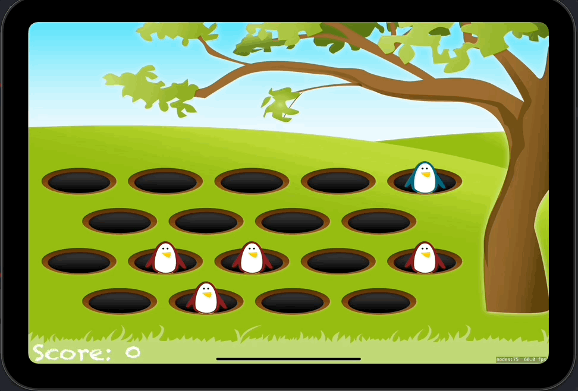

# Day 55: Project 14, Part One

## Notes
- Setting Up
- SKCropNode
- SKAction

So today we start again with a new project. Another game project! We call it Whack-A-Penguin. 

Aside from the things we learned from our previous game project, this project introduced a new classes called `SKCropNode` and `SKAction`.

### SKCropNode
A node that masks pixels drawn by its children so that only some pixels are seen.
Declaration

SKCropNode is a container node that you use to crop other nodes in the scene. You add other nodes to a crop node and set the crop node's maskNode property.

### SKAction
An object that is run by a node to change its structure or content.

SKAction is an animation that is executed by a node in the scene. Actions are used to change a node in some way (like move its position over time), but you can also use actions to change the scene, like doing a fadeout. When the scene processes its nodes, the actions associated with those nodes are processed.

On this project, we used the `moveBy` method of SKAction to make the penguins move up from our WhackSlot

We haven't done any tapping/hitting handlers for the penguins yet. That will be for tomorrow's lesson i guess?

## Screenshots

