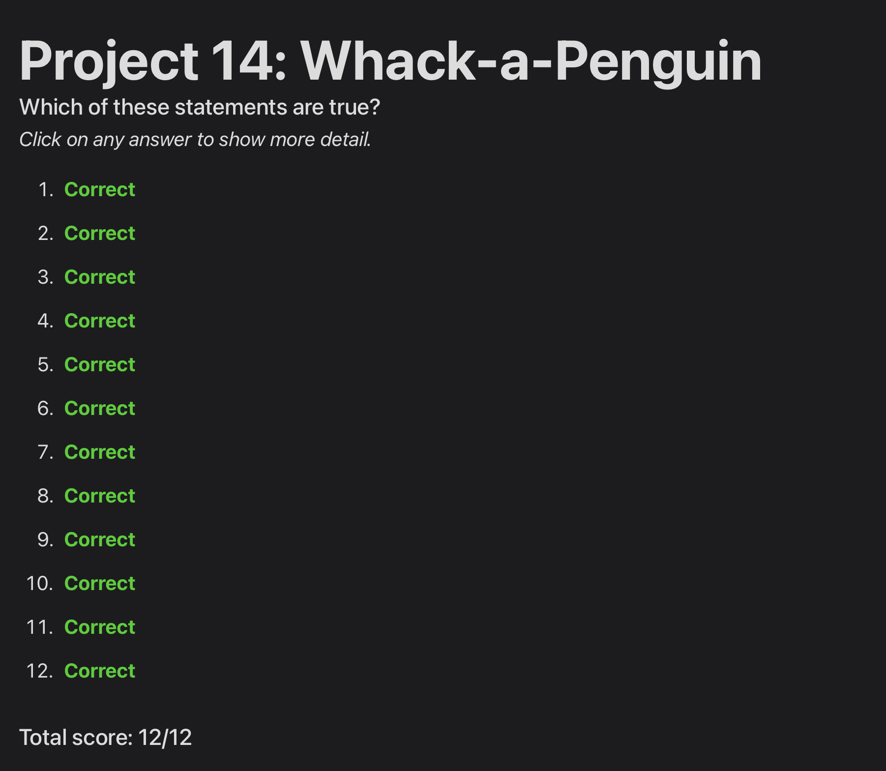

# Day 56: Project 14, Part Two

## Notes

## Challenges

1. Record your own voice saying "Game over!" and have it play when the game ends.
2. When showing “Game Over” add an SKLabelNode showing their final score.
3. Use SKEmitterNode to create a smoke-like effect when penguins are hit, and a separate mud-like effect when they go into or come out of a hole.

## Screenshots

