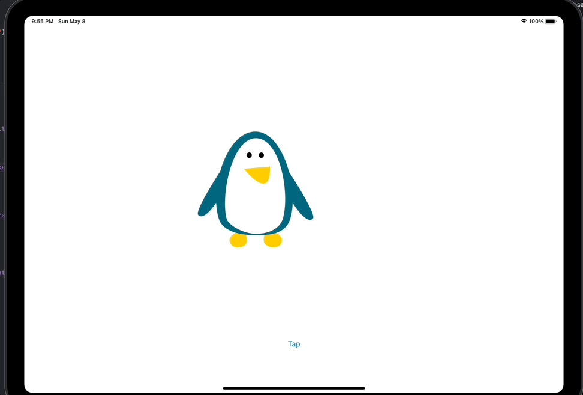

# Day 57: Project 15, Part One

## Notes

On this day we start again with a new project! A simple project that will introduce Animation.


## animate(withDuration:)
Is a new method of `UIView` class that we are going to learn today. This method accepts two closures and it accepts parameters of _how long to animate_, _how long to pause before animation starts_ and _any options you want to provide_. The closures are _what animations to execute_ and finally _a closure that will execute when the animation is done_

```swift
UIView.animate(withDuration: 1, delay: 0, usingSpringWithDamping: 0.5, initialSpringVelocity: 5, options: [],
               animations: {
    
}) { finished in

}
```

## CGAffineTransform
An affine transformation allows a `UIView` to be translated, scaled, rotated or skewed. `UIView`s have a `CGAffineTransform` property called `transform`

What is _affine transformation_? It is a transformation that preserves proportions and collinearity between points.

Example:
```swift
self.imageView.transform = CGAffineTransform(scaleX: 2, y: 2)
```

With this example, we make the image view twice scale up twice.

## Screenshots

