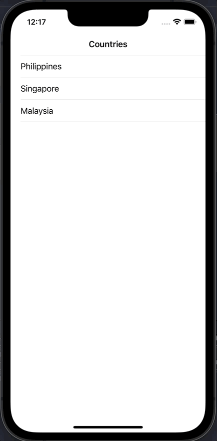

# Day 59: Milesstone: Project 13-15

## Notes

## Challenges
Your challenge is to make an app that contains facts about countries: show a list of country names in a table view, then when one is tapped bring in a new screen that contains its capital city, size, population, currency, and any other facts that interest you. The type of facts you include is down to you – Wikipedia has a huge selection to choose from.

## Screenshots

