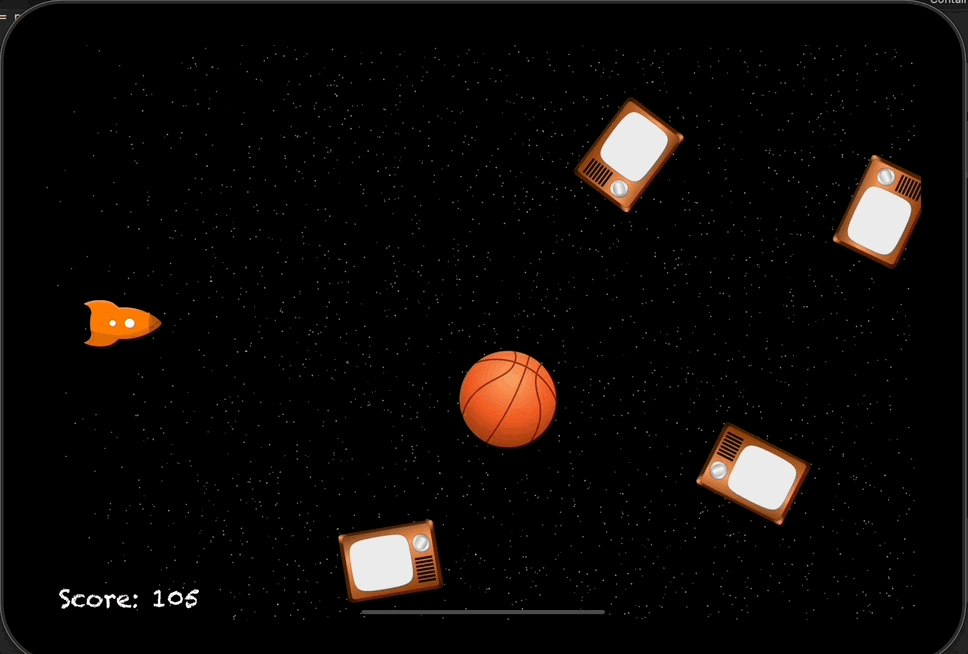

# Day 62: Project 17, Part One

## Notes

On this day we start again with a new game project. It's like the Space Impact game on your old mobile phones back then.

So as like before, we setup the UI by adding different kind of Nodes.


We also learned how to do a _collision detection_ using the `SKPhysicsContactDelegate` method `didBegin(_:)`

```swift
func didBegin(_ contact: SKPhysicsContact) {
    let explosion = SKEmitterNode(fileNamed: "explosion")!
    explosion.position = player.position
    addChild(explosion)

    player.removeFromParent()

    isGameOver = true
}
```

We also learned how we can modify the body linear velocity and body rotational velocity of a physicsBody using the `linearDamping` and `angularDamping` properties.

## Screenshots



