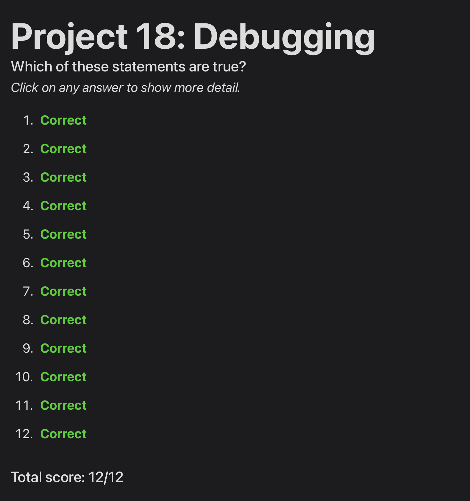
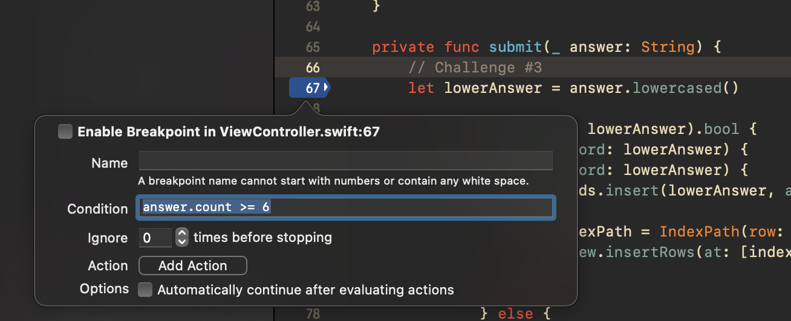

# Day 65: Project 18, Part Two

## Notes

## Challenges
1. Temporarily try adding an exception breakpoint to project 1, then changing the call to instantiateViewController() so that it uses the storyboard identifier “Bad” – this will fail, but your exception breakpoint should catch it.
2. In project 1, add a call to assert() in the viewDidLoad() method of DetailViewController.swift, checking that selectedImage always has a value.
3. Go back to project 5, and try adding a conditional breakpoint to the start of the submit() method that pauses only if the user submits a word with six or more letters.

## Screenshots

