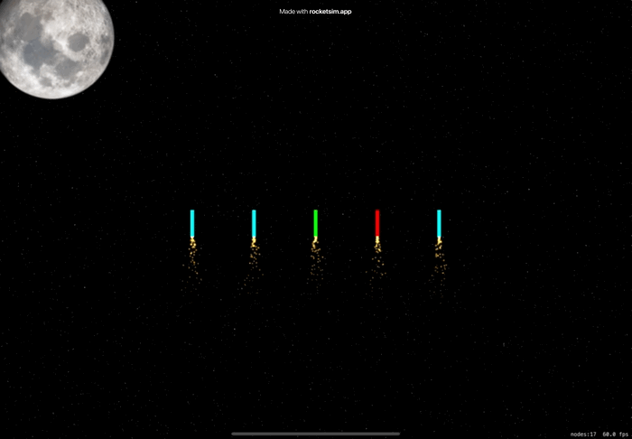

# Day 70: Project 20, Part One

## Notes
Today we are going to start again with another game project 😅.

Not really interested with games, so I just followed the lecture. Nothing much difference from previous game projects other than using `UIBezierPath`, `SKAction.follow()` and `for case let`

## Screenshots

