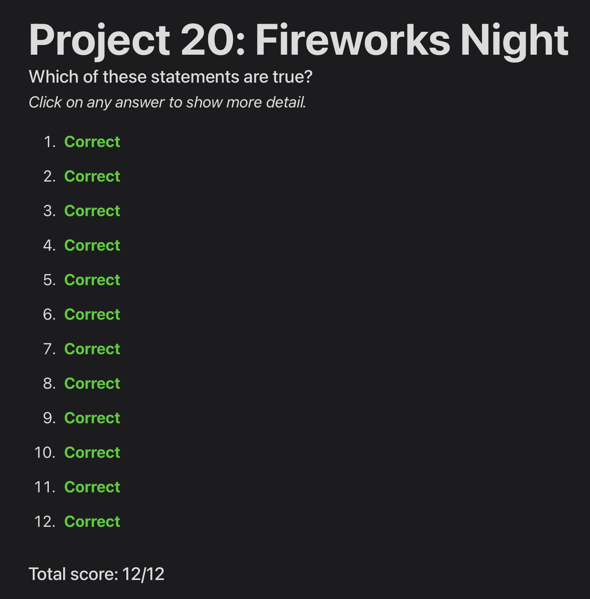
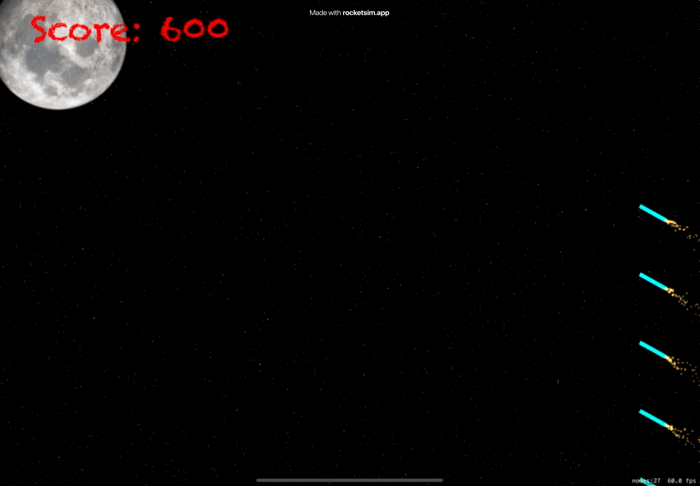

# Day 71: Project 20, Part Two

## Notes

## Challenges
1. For an easy challenge try adding a score label that updates as the player’s score changes.
2. Make the game end after a certain number of launches. You will need to use the invalidate() method of Timer to stop it from repeating.
3. Use the waitForDuration and removeFromParent actions in a sequence to make sure explosion particle emitters are removed from the game scene when they are finished.

## Screenshots

