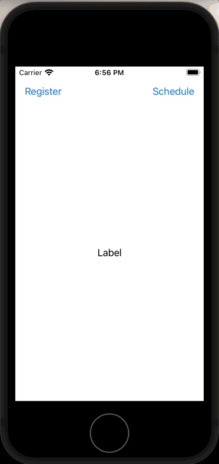

# Day 72: Project 21, Part One

## Notes

- setting up
- Scheduling notifications
- acting on response


On this day, we start again we a new project that is about `UNUserNotificationCenter`. For this simple project we are not doing any Push Notification from a remote server. We'll just do a _Local Notifications_


First, we set a method that will register your app for notifications. We first need to request permission. You can't do notifications unless you have your user's permission.

```swift
@objc func registerLocal() {
    let center = UNUserNotificationCenter.current()

    center.requestAuthorization(options: [.alert, .badge, .sound]) { (granted, error) in
        if granted {
            print("Yay!")
        } else {
            print("D'oh")
        }
    }
}
```

Once we have our user permission, we can set a _Local Notification_ already.

```swift
@objc func scheduleLocal() {
    registerCategories()
    
    let center = UNUserNotificationCenter.current()
    let content = UNMutableNotificationContent()
    content.title = "Late wake up call"
    content.body = "The early bird catches the worm, but the second mouse gets the cheese."
    content.categoryIdentifier = "alarm"
    content.userInfo = ["customData": "fizzbuzz"]
    content.sound = UNNotificationSound.default
    
    var dateComponents = DateComponents()
    dateComponents.hour = 10
    dateComponents.minute = 30
    let trigger = UNTimeIntervalNotificationTrigger(timeInterval: 5, repeats: false) // Triggers notification after 5 seconds
    
    let request = UNNotificationRequest(identifier: UUID().uuidString, content: content, trigger: trigger)
    center.add(request)
}
```


## Other things we can do with _Notifications_

We can do this using `UNNotificationAction` and `UNNotificationCategory` classes.

`UNNotificationAction` creates a button for the user to tap and `UNNotificationCategory` groups multiple buttons together under a single identifier.

```swift
let center = UNUserNotificationCenter.current()
center.delegate = self

let show = UNNotificationAction(identifier: "show", title: "Tell me more…", options: .foreground)
let category = UNNotificationCategory(identifier: "alarm", actions: [show], intentIdentifiers: [])

center.setNotificationCategories([category])
```

And we have to handle this using the `UNUserNotificationCenterDelegate`

```swift
func userNotificationCenter(_ center: UNUserNotificationCenter, didReceive response: UNNotificationResponse, withCompletionHandler completionHandler: @escaping () -> Void) {
    let userInfo = response.notification.request.content.userInfo

    if let customData = userInfo["customData"] as? String {
        print("Custom data received: \(customData)")

        switch response.actionIdentifier {
        case UNNotificationDefaultActionIdentifier:
            print("Default identifier")

        case "show":
            print("Show more information…")

        default:
            break
        }
    }

    // Have to call this handler when everything is done
    completionHandler()
}
```


## Screenshots


