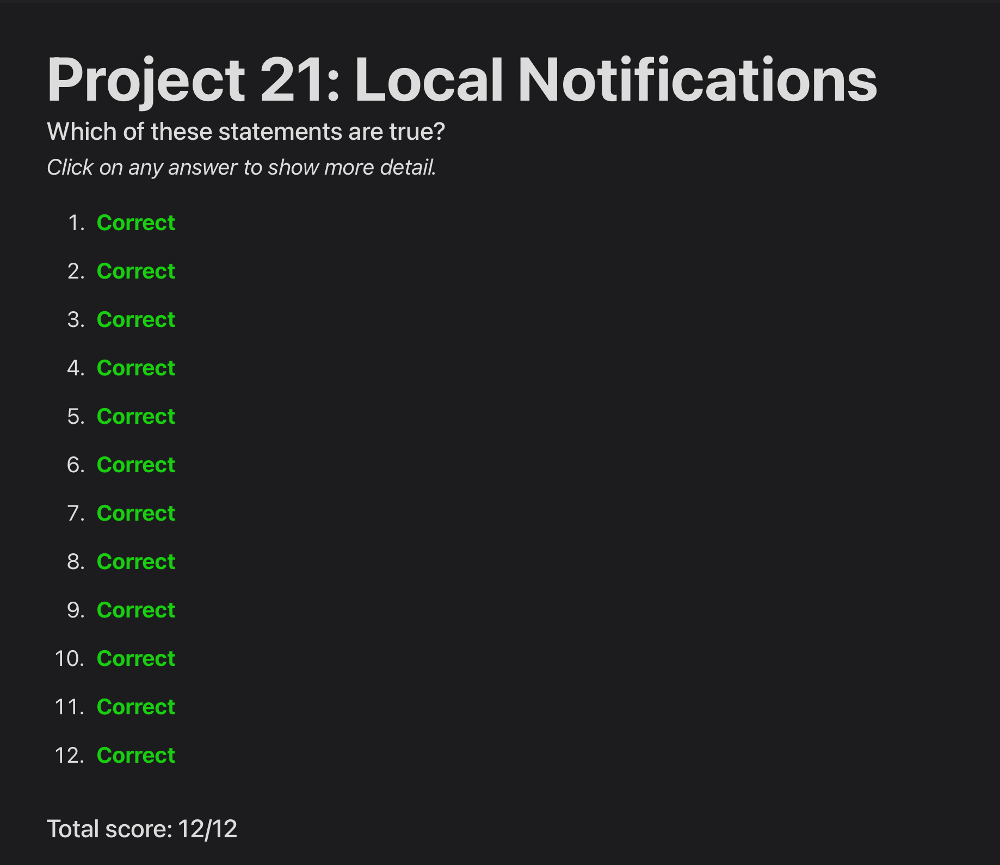
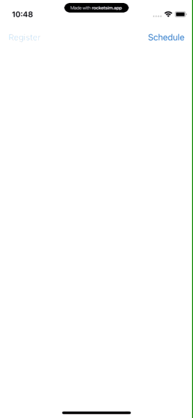

# Day 73: Project 21, Part Two

## Notes

## Challenges

1. Update the code in didReceive so that it shows different instances of UIAlertController depending on which action identifier was passed in.
2. For a harder challenge, add a second UNNotificationAction to the alarm category of project 21. Give it the title “Remind me later”, and make it call scheduleLocal() so that the same alert is shown in 24 hours. (For the purpose of these challenges, a time interval notification with 86400 seconds is good enough – that’s roughly how many seconds there are in a day, excluding summer time changes and leap seconds.)
3. And for an even harder challenge, update project 2 so that it reminds players to come back and play every day. This means scheduling a week of notifications ahead of time, each of which launch the app. When the app is finally launched, make sure you call removeAllPendingNotificationRequests() to clear any un-shown alerts, then make new alerts for future days.

## Screenshots

