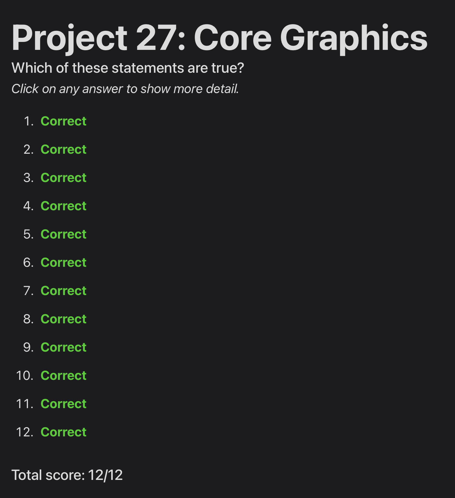
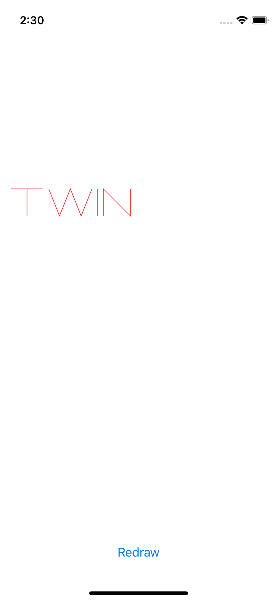
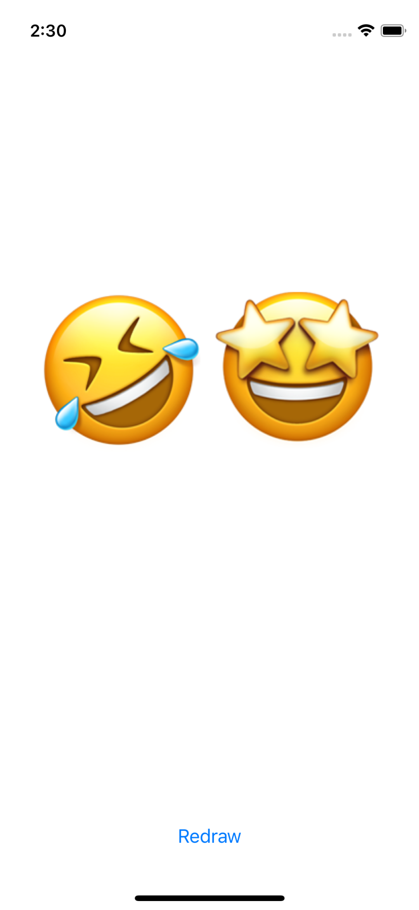

# Day 89: Project 27, Part Two

## Notes

## Challenges
1. Pick any emoji and try creating it using Core Graphics. You should find some easy enough, but for a harder challenge you could also try something like the star emoji.
2. Use a combination of move(to:) and addLine(to:) to create and stroke a path that spells “TWIN” on the canvas.
3. Go back to project 3 and change the way the selected image is shared so that it has some rendered text on top saying “From Storm Viewer”. This means reading the size property of the original image, creating a new canvas at that size, drawing the image in, then adding your text on top.

## Screenshots

