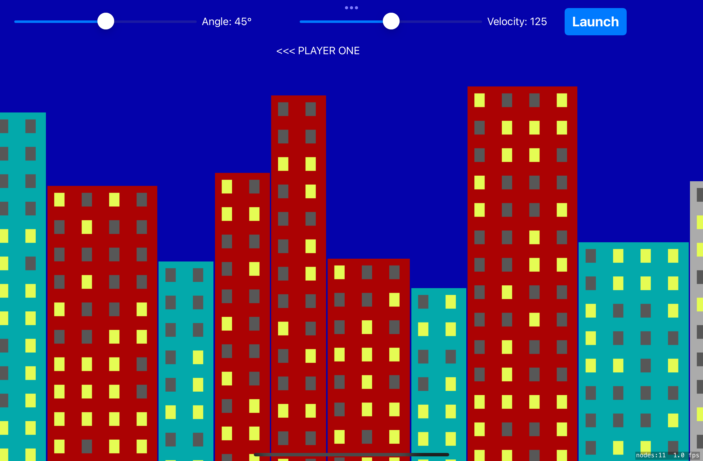

# Day 94: Project 29, Part One

## Notes
Today we are going to start with another game project that makes use of UIKit and SpriteKit together. Well, technically, we are using them both already with previous SpriteKit projects. Just this time, we are going to use `Game View Controller` already to hold a reference with the `Game Scene` because we are adding some UIKit components like `UISlider`, `UILabel` and `UIButton`

## Screenshots

