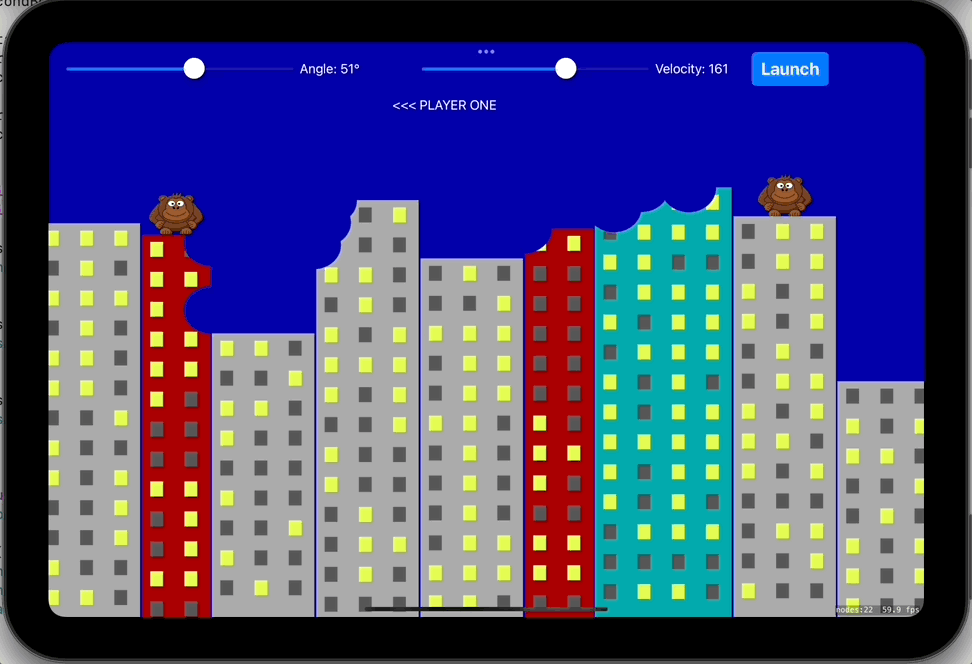

# Day 95: Project 29, Part Two

## Notes
- unleash the bananas - SpriteKit texture atlases
- destructible terrain - presentScene

Today we are going to add the assets in our SpriteKit project using the _Sprite Atlas_ in our XCAssets and setup the monkeys in top of the buildings.

Next is we made our buildings destructible with a lot of steps under the hood. We make use of `UIGraphicsImageRenderer` to draw a circle like destruction on our buildings + `SKPhysicsBody`

Once a player hits the other player, the game is over. We make use of the `presentScene` to make a new game. :]

## Screenshots

